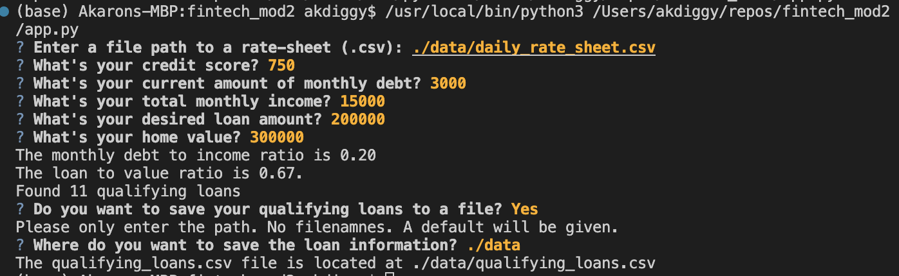

# Challenge assignment for Module 2

My program answers the following user story requirement: As a user, I need the ability to save the qualifying loans to a CSV file so that I can share the results as a spreadsheet.

When the following values are entered (path to a rate sheet/credit score/current amount of monthly debt/total monthly income/desired loan amount/home value), the following values are calculated given those values: monthly debt to income ratio, loan to value ratio, the number of qualifying loans. Once that is calculated, the user will be asked if they want to save the qualifying loans to a file. If the answer is 'Yes', they will be prompted to enter where they would like to store the .csv file on the local host.

## Technologies

The app.py program was written using Python version 3.11. 

## Usage

This screen capture shows when a path is entered and there are no issues. 

This screen capture shows when an invalid path is entered to save the .csv file. 

## Contributors

Akaron Davis

## License

The files used are not to be used by others. 
